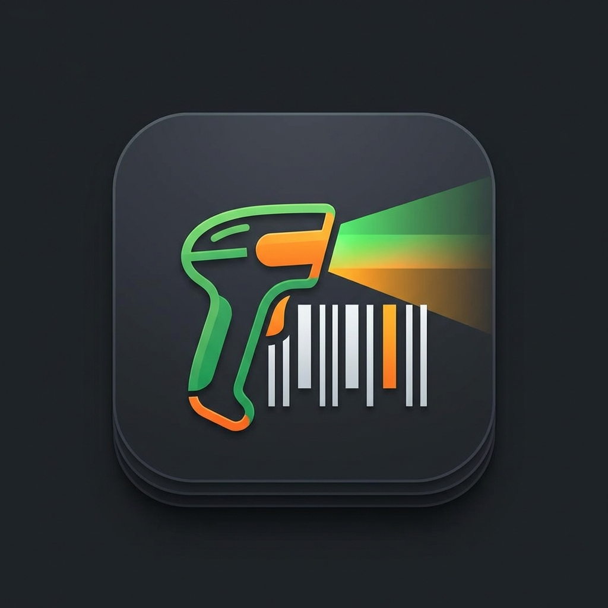

# 🏪 Barkod Stok Takip ve Satış Sistemi (POS)

Modern arayüze sahip, Python ve CustomTkinter ile geliştirilmiş, platform bağımsız (Windows/Linux/MacOS) stok takip ve satış uygulaması.



## 🚀 Özellikler

*   **🛒 Hızlı Satış (POS):** Barkod okuyucu ile anında sepete ekleme, nakit/kredi kartı seçimi.
*   **📦 Stok Yönetimi:** Ürün ekleme, stok güncelleme, barkod veya ID ile arama.
*   **📋 Filtreli Liste:** Onbinlerce ürünü hızlıca filtreleme (ID, Barkod, İsim) ve sayfalı (pagination) görünüm.
*   **📊 Raporlama:** Gün sonu raporu (Nakit/Kart ayrımı, toplam ciro).
*   **⚡ Performans:** Büyük veri setleri için optimize edilmiş veritabanı yapısı.
*   **🛠️ Kolay Düzenleme:** Tek bir yerden ürünün tüm bedenlerinin fiyatını güncelleme özelliği.

## 📂 Proje Yapısı

```
Barcode_reader/
├── assets/          # İkonlar ve görseller
├── scripts/         # Build ve yardımcı araçlar
├── ui/              # Arayüz dosyaları (frames, windows)
├── database.py      # Veritabanı ve ORM işlemleri
├── main.py          # Uygulama giriş noktası
├── requirements.txt # Kütüphane bağımlılıkları
└── run_pos.bat      # Windows için hızlı başlatıcı
```

## 🛠️ Kurulum ve Çalıştırma

### Gereksinimler
*   Python 3.8 veya üzeri
*   `pip` paket yöneticisi

### 1. Kütüphaneleri Yükleyin
Terminal veya komut satırında proje dizinine gelip şu komutu çalıştırın:
```bash
pip install -r requirements.txt
```

### 2. Uygulamayı Başlatın

**Linux / MacOS:**
```bash
python main.py
```

**Windows:**
`run_pos.bat` dosyasına çift tıklayın veya:
```cmd
python main.py
```

## 📦 Windows için .EXE Oluşturma (Build)

Uygulamayı Python kurulu olmayan bilgisayarlarda çalıştırmak için `.exe` dosyasına dönüştürebilirsiniz.

1.  Proje dizininde terminal açın.
2.  Build scriptini çalıştırın:
    ```bash
    python scripts/build_exe.py
    ```
3.  İşlem bittiğinde **`dist/`** klasörü içinde **`BarkodPOS.exe`** dosyasını bulabilirsiniz.
    *   *Not: `stock.db` dosyasını exe'nin yanına kopyalamayı unutmayın.*

## 🔒 Lisans
Bu proje açık kaynaklıdır ve eğitim/geliştirme amaçlıdır.
